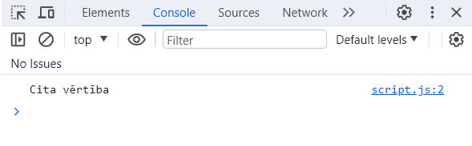

# Mainīgie

Iepriekšajā nodaļā mēs uzstādijām mūsu projektu un iemācijāmies kā izvadīt tekstu konsolē. Šajā nodaļā mēs mācīsimies par programmas pamatvienību - mainīgo.

Kas tad *ir* mainīgie? Mainīgais, jeb no angļu valodas **Variable**, ir kā datu konteineris, kurā glabāt datus.

Vispopulārākā analoģija par mainīgajiem ir šāda: mainīgo var iedomāties kā kasti, kurā var ielikt kādu priekšmetu, jeb vērtību, kā piemēram tekstu vai skaitli. Jebkurā brīdi mēs varam izņemt šo priekšmetu no kastes un ielikt tajā citu priekšmetu. Ir iespējams arī atstāt šo kasti tukšu, bez vērtības.

Lai kodā izveidotu mainīgo, uzrakstiet sekojošo:

```
let mans_mainigais = 5
```

Šis kods izveido mainīgo ar nosaukumu `mans_mainīgais` un nosaka tam vērtību `5`. Ja atskatamies uz mūsu kastu analoģiju, tad mums ir kaste ar nosaukumu `mans_mainīgais`, kurā esam ielikuši skaitli 5.

Izanalizēsim iepriekšējo koda rindiņu:

`let` saka programmai ka mēs vēlamies izveidot mainīgo. `let` var nomainīt pret `var` vai `const`, un tas izveidos mainīgo bet programma attieksies pret to nedaudz savādāk. Par to nedaudz vēlāk.

nākošais seko teksts `mains_mainigais`, kas ir mainīgā nosaukums. To var nomainīt pret jebkādu citu tekstu, bet tam jāseko šādiem noteikumiem:

 * nedrīkst būt vairāki mainīgie ar vienu un to pašu nosaukumu
 * nosaukumā drīkst būt burti un cipari, bet:
 * tajā nedrīkst būt atstarpēm, piemēram `mans mainigais`
 * tam jāsākas ar ar burtu, zemsvītru(_) vai dolāra zīmi($). Nekādu citu simbolu, piemēram ciparu vai '&' zīmi, nedrīkst lietot kā pirmo, piemēram `1mans_mainigais` vai `&mans_mainigais`
 * tas nedrīkst būt tāds pats kā **rezervēts** vārds.
 * ir iespējams, bet nav rekomendēts lietot mainīgā nosaukumā īpašos simbolus un garumzīmes, tā kā ne visi pārlūki spēj atšifrēt šos simbolus kad lasa programmu.

 > Rezervēts vārds tas ir jebkurš vārds kurš tiek lietots lai vadītu programmu, piemēram `let` vai `function` vai `class`. Ja mēs lietotu rezervētu vārdu mainīgā nosaukumā, programma apjuktu jo domātu ka tai vajag palaist darbību atbilstoši rezervētajam vārdam. [Saraksts ar rezervētiem vārdiem JavaScript valodā](#TODO)

Katrā valodā šie noteikumi var būt nedaudz savādāki, bet vairāk vai mazāk ir vienādi.

Mēs varētu nosaukt mūsu mainīgo piemēram par `skaitlis` vai `pica`.

> Parasti mainīgos nosauc atblistoši tam, priekš kā viņus lieto

tālāk iet ` = 5`, kas pasaka programmai ka mēs gribam pievienot šim mainīgajam vērtību `5`. Šī vērtība varētu būt arī kāda cita, piemēram cits skaitlis vai kāds teksts, vai arī cits mainīgais. Ja vēlamies pievienot tekstu, tam ir jābūt pēdiņās:

**Nepareizi:**
```
let mans_mainigais = Vārds
```

**Pareizi:**
```
let mans_mainigais = "Vārds"
```
**Vai**
```
let mans_mainigais = 'Vārds'
```

JavaScript valodā var lietot gan vienpēdiņas ' gan dubultpēdiņas ". Bet ir citas valodas kurās var lietot tikai vienu vai otru.

Iepriekšējā nodaļā iemācijāmies nedaudz par funkcijām, un par to, ka tām var dot argumentus. Funkcijai ir iespējams sniegt arī mainīgo kā argumentu.

Iekopējiet šo kodu, saglabājiet to un atjauniniet savu mājaslapu:

```
let mans_mainigais = 5
console.log(mans_mainigais)
```

konsolē vajadzētu tikt izvadītam jūsu mainīgajam.

Iepriekšējajā koda pirmajā rindiņā mēs **deklarējam** un **definējam** mainīgo `mans_mainigais` ar vērtību 5, tad nākošajā rindiņā ar `console.log()` mēs izvadam šo mainīgo uz konsoli.

> **Deklarēt** mainīgo nozīmē izveidot to, un **Definēt** nozīmē pievienot tam vērtību. Ir iespējams deklarēt mainīgo bez definēšanas. Par to nedaudz zemāk.

Varat nomainīt mainīgo pret citu vērtību, piemēram citu skaitli vai kādu tekstu, un konsole atbilstoši izvadīs šo  vērtību:

```
let mans_mainigais = "Cita vērtība"
console.log(mans_mainigais)
```



Ir iespējams arī uzrakstīt vairākas rindiņas ar dažādiem mainīgajiem un dažādām vērtībām

```
let mans_mainigais = "Vērtība"
let cits_mainigais = "Cita vērtība"
let skaitlis = 4

console.log(mans_mainigais)
console.log(skaitlis)
console.log(cits_mainigais)
```

## Vērtības maiņa

Ir iespējams nomainīt viena un tā paša mainīgā vērtību pret citu vērtību. Ja mainam jau pastāvoša mainīgā vērtību, tad priekšā nav jāraksta `let`:

```
let mans_mainigais = 'Vērtība'
mans_mainigais = 'Jaunā vērtība'
```

## Mainīgais kā vērtība

Ir iespējams pievienot mainīgajam cita mainigā vērtību, lūk šādi:

```
let mans_mainigais = 5
let cits_mainigais = mans_mainigais

console.log(cits_mainigais)
```


## Deklarēšana un definīcija

Ir iespējams deklarēt(izveidot) mainīgo bet nedefinēt to (nepievienot tam vērtību)

```
let mans_mainigais
```

Šādam mainīgajam bez vērtības tehniski tāpat ir vērtība, un šī vērtība ir `undefined`. pastāv arī cita "bezvērtības" vērtība - `null`.

## Vērtību tipi

Mainīgo vērtības iedalās vairākos vērtību tipos. Šie tipi ir:

 * number (skailtis)
 * string (teksts)
 * boolean (patiess/nepatiess)
 * object (objekts), kurš iedalās kategorijās:
   * object (objekts)
   * class (klase)
   * function (funkcija)
   * array (masīvs)
 * undefined (bezvērtības)
 * null (bezvērtības)

Pastāv arī daži citi vērtību tipi, bet par tiem iesācējam nav jāuzstracas.

> Par objektiem mēs runāsim citā nodaļā

**boolean** vērtība var nozīmēt vienu no diviem - patiess vai nepatiess, jeb **true** vai **false**

```
let mainigais = false
let cits_mainigais = true
```

## Mainīgo aritmētika

Visspēcīgākā mainīgo iezīme drošivien ir aritmētika. Mainīgajam var pievienot aritmētisku vērtību, piemēram

```
let summa = 2 + 2
console.log(summa) // 4
```

vai

```
let vertiba = 5 * 20 + 15
console.log(vertiba) // 115
```

JavaScript valodā pastāv šādi aritmētikas simboli:

 * \+ (saskaitīšana)
 * \-  &nbsp;(atņemšana)
 * /  &nbsp;(dalīšana)
 * \* &nbsp;(reizināšana)
 * \** (kāpināšana)
 * % (modulus jeb dalīšanas atlikums)
 * () (grupēšana ar iekavām)

Var izteiksmi grupēt ar iekavām, tāpat kā matemātikā:

```
let vertiba = 2 * (4 + 1)
console.log(vertiba) // 10
```

Ir iespējams arī pieletot citu mainīgo aritmētikā, piemēram:

```
let skaitlis1 = 10
let skaitlis2 = 40
let summa = skaitlis1 + skailtis2
console.log(summa) // 50
```

Nav obligāti jāizveido mainīgais lai sniegtu argumentu funkcijai, var aritmētisko darbību sniegt "pa taisno"

```
console.log(15 + 15) // 30
```

bet vispārīgi runājot ir rekomendēts izveidot mainīgo priekš argumenta, jo tas padara jūsu kodu lasāmāku.

Ir iespējams mainīgo paaugstināt vai samazināt par vienību, izmantojot `++` vai `--`, šādi:

```
let skaitlis = 1
console.log(skaitlis) // 1
skaitlis++
console.log(skaitlis) // 2 
skaitlis++
console.log(skaitlis) // 3
skaitlis--
console.log(skaitlis) // 2
```

Mainīgo aritmētika pārsvarā attiecas uz skaitļiem. Reti kad var pielietot aritmētiku ar citiem tipiem. Iznēmums ir string(teksts), kur var pielietot `+` zīmi lai savienotu vairākus tekstus kopā:

```
let pirmais_teksts = "Sveika "
let otrs_teksts = "Pasaule!"
console.log(pirmais_teksts + otrs_teksts) // Sveika Pasaule!
```

Skaitliskus mainīgos var arī definēt kā negatīvus skaitļus:

```
let skaitlis = -10
```

## Kopsavilkums

 * Mainīgie ir programmēšanas pamatvienība kas ļauj saglabāt vērtību, piemēram skaitli vai tekstu un vēlāk to izmantot citviet
 * Mainīgo var **deklarēt**, jeb izveidot to
 * Mainīgo var pēctam **definēt**, jeb pievienot tam vērtību
 * Mainīo nosaukumi seko noteiktiem noteikumimem, kurus neievērojot programma nespēs darboties.
 * Mainīgajiem pastāv vairāki vērtību tipi, kā skaitlis, teksts, `patiess`/`nepatiess`.
 * Skaitliskiem mainīgajiem var pieletot aritmētiskas darbības kā saskaitīšanu, atņemšanu, reizināšanu, dalīšanu


## Noslēgums

Šajā nodaļā iemācijāmies par programmēšanas pamatvienību - mainīgajiem. Mainīgos ir 100% nepieciešams apgūt jebkuram programmētājam, takā tie tiek ļoti bieži lietoti rakstot kodu.

Iemācijāmies par tādām mainīgo iezīmēm kā deklarēšana un definīcija, aritmētika, vērtību tipiem.

Lai nostiprinātu jūsu jauniegūtās zināšanas, varat atbildēt uz jautājumiem un izpildīt uzdevumus

Nākošajā nodaļā mācīsimies par nosacījumiem un cikliem - veidu kā programmu var daudzveidot.


## Jautājumi

2.1: Vienkāršos vārdos, paskaidrojiet kas ir mainīgie?

A: Mainīgais tas ir konteineris, kurā var ievietot kādu vērtību. Šo vērtību var vēlāk nomainīt. Var arī atstāt šo konteineri tukšu, bez vērtības.

2.2: Vai mainīgā nosaukumā drīkst būt atstarpēm?

A: Nē

2.3: Vai mainīgā nosaukumā drīkst lietot ciparus?

A: Jā, bet ne kā pirmo simbolu nosaukumā

2.4: Kā mainīgā deklarēšana atšķiras no definēšanas?

A: Deklarēt mainīgo nozīme to izveidot, definēt nozīmē pievienot tam vērtību

2.5: Vai drīkst būt mainīgais bez vērtības?

A: Jā(bet tehniski runājot pat bezvērtības mainīgajiem ir vērtība - `undefined`)

2.6: Vai drīkst pievienot kādu mainīgo kā cita mainīgā vērtību?

A: Jā, piemēram `let mans_maingais = cits_mainigais`

2.7: Vai ir iespējams pielietot aritmētiku kad definē mainīgo?

A: Jā, var izmantot vairākus pamataritmētikas darbības, kā saskaitīšanu, atņemšanu, reizināšanu, dalīšanu

2.8: Kā var paaugstināt vai samazināt mainīgo par vienu vienību?

A: Rakstot `mainigais++` vai `mainigais--` respektīvi

2.9: Vai var lietot citus mainīgos kad definē mainīgo ar artimētiku?

A: Jā

## Uzdevumi

1.1: Uzrakstiet programmu, kura izveido mainīgo un definē tam vērību 5, tad izvada to konsolē

```
let mans_mainigais = 5
console.log(mans_mainigais)
```

1.2: Uzrakstiet programmu, kura:

1. Izveido divus mainigos un pievieno katram jebkādu skaitlisku vērtību
2. Izveido vēlvienu mainigo kurš saskaita abus iepriekšējos mainīgos
3. Izvada jaunā mainīgā vērtību konsolē

```
let skaitlis1 = 10
let skaitlis2 = 5
let summa = 10 + 5
console.log(summa)
```

1.3: Uzrakstiet programmu, kura:

1. Izveido mainīgo ar vērtību "Man patīk " (ievērojiet atstarpi teksta beigās)
2. Izveido mainīgo ar vērtību ar tekstu ar kādas lietas nosaukumu, kura jums patīk
3. Izvada konsolē šo abu mainīgo savienojumu, kai iznāktu "Man patīk \_\_\_" (kur \_\_\_ būtu jūsu izvēlētās lietas nosaukums)

```
let vards1 = "Man patīk "
let vards2 = "programmēšana"
console.log(vards1 + vards2)
```