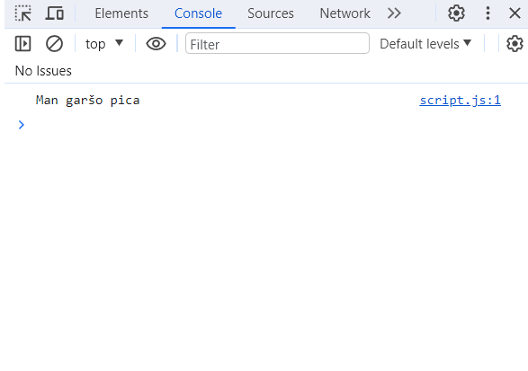

## Pirmie soļi

### Sagatavošanās

Pirms sākt programmēt, mums būs nepieciešamas pāris programmatūras. Tās ir -

 * Tekstapstrādes programmatūra
 * Interneta pārlūks

#### Tekstapstrādes programmatūra

Tekstapstrādes programmatūra var būt jebkāda programmatūra kura ļauj veidot un saglabāt teksta failus. Ja jums ir Windows, tas var būt Notepad. Bet mana rekomendācija ir lejuplādēt kādu bezmakskas **Integrated Development Environment**, jeb Integrēto Izstrādes Vidi (saīsinājumā IDE). IDE tas ir rīks kas stipri atvieglo programmu rakstīšanu. Tas sniedz tādas funkcijas kā Auto Completion un Syntax Highlighting. Ja nezinat neko par IDE, varat droši lejuplādēt [VSCode](https://code.visualstudio.com/). VScode ir bezmaskas IDE kurš ir piemērots iesācējiem. Bet ja nevarat sagaidīt kad jau varēsiet rakstīt kodu, varat izlaist šo soli un lietot vienkārši Notepad.

#### Interneta pārlūks

Šajā grāmata tiks lietots pārlūks Chrome, bet jūs varat lietot jebkuru citu pārlūku - soļi būs vairāk vai mazāk vienādi.

### Projekta izveide

Lai izveidotu jaunu projektu, izveidojiet mapīti kautkur jums ērti pieejamā vietā ar jums vēlamo nosaukumu. Es nosaukšu savu mapīti par `mans projekts`


Iekšā mapītē, izveidojiet 2 texta failus: `page` un `script`


Lai redzētu failu galus, Atveriet mapīti, ieejiet `View` opcijās un atzīmējiet norādīto aili, ja tā nav jau atzīmēta


Pārsauciet `script` faila galu no `.txt` uz `.js` un `page` faila galu no `.txt` uz `.html`

> Faila gals, jeb **file extension**, nosaka to, kādā veidā programmatūra lasīs šo failu. Noteiktām programmatūrām nepieciešami noteikti faila gali, mūsu gadījuma ir nepieciešami `.html` priekš mājas lapas un `.js` priekš pašas JavaScript programmas.

Ja visu izdarījāt pareizi, tagad jūsu failiem būtu jāizskatās šādi


Tas nekas ja jūsu ikonas izskatās savādāk, galvenais ir nosaukumi un failu gali.

Tagad atveriet `page.html` ar savu tekstapstrādēs programmatūru. Lai to izdarītu, noklikšķiniet uz faila ar labo peles pogu, tad `Open With`, un tad izvēlaties savu tekstapstrādes rīku.

Vajadzētu atvērties logam ar jūsu teksta failu

;

Iekopējiet šajā teksta failā sekojošo kodu:

```
<!DOCTYPE html>
<html>
    <head>
    </head>
    <body>
        Mana mājas lapa
        <script src='./script.js' ></script>
    </body>
</html>
```

Saglabājiet failu.

Tagad atveriet šo failu savā interneta pārlūkā. Lai to izdarītu, noklikšķiniet uz faila ar labo peles pogu, tad `Open With`, un tad izvēlaties savu interneta pārlūku.

Vajadzētu atvērties jūsu lapai, ar tekstu "Mana mājas lapa".


Šajā grāmatā mēs nemācīsimies web izstrādi, jeb HTML un CSS, bet gan tikai programmēšanu, takā jums nav jāsaprot ko nozīmē kods kuru mēs iekopējām failā. Šis kods vienkārši izveido mājas lapu, un palaiž mūsu JavaScript kodu. Mēs nestrādāsim ar pašas mājas lapas izveidi, bet gan ar JavaScript kodu kuru šī mājas lapa palaiž.

Tagad, atrodoties mūsu izveidotajā lapā pārlūkā, nospediet `F12` pogu (iespējams ka citā pārlūkā jāspiež cita poga). Atvērsies panelis, zināms kā **Developer Tools** jeb **Izstrādātāja Rīki**. Šīs ir panelis ar daudz dažādiem rīkiem, kuri palīdz mājas lapas izstrādes procesā. Mēs izmantosim tikai vienu no šiem rīkiem - Konsoli jeb **Console**.

Konsole tā ir vieta kur programma var izvadīt kādu tekstu, kuru programmētājs var apskatīt. Tā ir lietderīga izstrādātājiem lai pārliecinātos ka programma strādā kā vajag, kā arī ir izpalīdzīgs rīks programmēšanas iesācējiem.

Ja jūsu **Developer Tools** panelī nav jau atvērta konsole, atveriet to, atrodot pogu ar nosaukumu **Console**


Tagad atveriet `script.js` failu savā tekstapstrādes rīkā, un uzrakstiet šo kodu:

```
console.log('Sveika Pasaule!')
```

Saglabājiet failu, tad atveriet savu lapu pārlūkā (`page.html`), atjauniniet savu lapu, un ieskatieties konsolē. Vajadzētu parādīties tekstam 'Sveika Pasaule!'.


> 'Sveika Pasaule!' jeb **'Hello World!'** Ir ikoniska frāze ko māca iesācējiem kad tie mācās izvadīt savu pirmo tekstu konsolē

Apsveicu, esat uzrakstījis un paladisi savu pirmo programmu!

Tagad iziesim cauri šai programmai un noskaidrosim kā tā strādā.

Vispirms mēs uzrakstam `console.log()`, ko sauc paur funkciju. Funkcija tas ir kods, kurš izpilda kautkādu konkrētu darbību programmā, mūsu gadījuma ko šī funkcija dara ir izvada tekstu konsolē.

Funkcija tas ir jebkāds teksts programmā kurš beidzas ar iekavām. Starp šīm iekavām var būt vēl kāds teksts, šo tekstu sauc par **Argumentiem**. Argumenti tas ir veids kā funkcijai sniegt papildus informāciju. Mūsu gadījumā mēs sniedzām funkcijai argumentu `'Sveika Pasaule!'`, un funkcija izvadīja tekstu atbilstoši šim argumentam.

Varat atvērt `script.js` un nomainīt tekstu `'Sveika Pasaule!'` uz kādu citu tekstu, piemēram `'Man garšo pica'`, šādi:

```
console.log('Man garšo pica')
```

Tad atjauniniet savu lapu pārlūkā, un konsolē atbilstoši vajadzētu izmainīties tekstam:



Ir iespējams uzrakstīt vairākas rindiņas ar funkcijām, un katra no šīm rindiņām tiks izpildīta secība no augšas uz leju. Piemēram, varam uzrakstīt vairākus `console.log()`:

```
console.log('Pirmais teksts')
console.log('Otrais teksts')
console.log('Trešais teksts')
```


Ja samainīt vietām kādu no tekstiem, šādi:

```
console.log('Otrais teksts')
console.log('Pirmais teksts')
console.log('Trešais teksts')
```


...tad arī secība konsolē izmainīsiem, jo dators lasa kodu no augšas uz leju.

Ar šo es beidzu šo nodaļu. Nākošajā nodaļā mēs mācīsimies par programmas pamatvienību - mainīgo.


Šajā grāmatā mēs mācīsimies programmēšanas valodu JavaScript. JavaScript ir iespējams palaist 

### Uzstādīšana