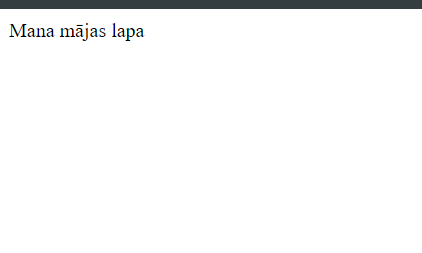
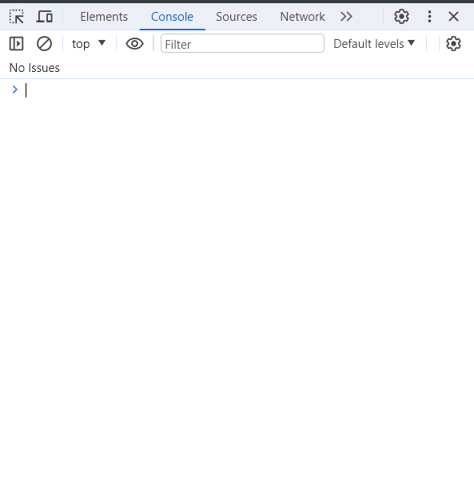
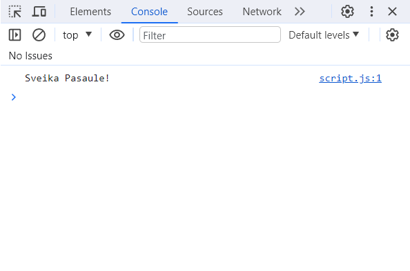
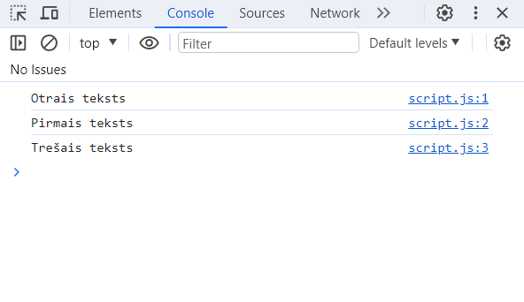

## Pirmie soļi

### Sagatavošanās

Pirms sākt programmēt, mums būs nepieciešamas pāris programmatūras. Tās ir -

 * Tekstapstrādes programmatūra
 * Interneta pārlūks

#### Tekstapstrādes programmatūra

Tekstapstrādes programmatūra var būt jebkāda programmatūra kura ļauj veidot un saglabāt teksta failus. Ja jums ir Windows, tas var būt Notepad. Bet mana rekomendācija ir lejuplādēt kādu bezmakskas **Integrated Development Environment**, jeb Integrēto Izstrādes Vidi (saīsinājumā IDE). IDE tas ir rīks kas stipri atvieglo programmu rakstīšanu. Tas sniedz tādas funkcijas kā Auto Completion un Syntax Highlighting. Ja nezinat neko par IDE, varat droši lejuplādēt [VSCode](https://code.visualstudio.com/). VScode ir bezmaskas IDE kurš ir piemērots iesācējiem. Bet ja nevarat sagaidīt kad jau varēsiet rakstīt kodu, varat izlaist šo soli un lietot vienkārši Notepad.

#### Interneta pārlūks

Šajā grāmata tiks lietots pārlūks Chrome, bet jūs varat lietot jebkuru citu pārlūku - soļi būs vairāk vai mazāk vienādi.

### Projekta izveide

Lai izveidotu jaunu projektu, izveidojiet mapīti kautkur jums ērti pieejamā vietā ar jums vēlamo nosaukumu. Es nosaukšu savu mapīti par `mans projekts`


Iekšā mapītē, izveidojiet 2 texta failus: `page` un `script`


Lai redzētu failu galus, Atveriet mapīti, ieejiet `View` opcijās un atzīmējiet norādīto aili, ja tā nav jau atzīmēta


Pārsauciet `script` faila galu no `.txt` uz `.js` un `page` faila galu no `.txt` uz `.html`

> Faila gals, jeb **file extension**, nosaka to, kādā veidā programmatūra lasīs šo failu. Noteiktām programmatūrām nepieciešami noteikti faila gali, mūsu gadījuma ir nepieciešami `.html` priekš mājas lapas un `.js` priekš pašas JavaScript programmas.

Ja visu izdarījāt pareizi, tagad jūsu failiem būtu jāizskatās šādi


Tas nekas ja jūsu ikonas izskatās savādāk, galvenais ir nosaukumi un failu gali.

Tagad atveriet `page.html` ar savu tekstapstrādēs programmatūru. Lai to izdarītu, noklikšķiniet uz faila ar labo peles pogu, tad `Open With`, un tad izvēlaties savu tekstapstrādes rīku.

Vajadzētu atvērties logam ar jūsu teksta failu

;

Iekopējiet šajā teksta failā sekojošo kodu:

```
<!DOCTYPE html>
<html>
    <head>
    </head>
    <body>
        Mana mājas lapa
        <script src='./script.js' ></script>
    </body>
</html>
```

Saglabājiet failu.

Tagad atveriet šo failu savā interneta pārlūkā. Lai to izdarītu, noklikšķiniet uz faila ar labo peles pogu, tad `Open With`, un tad izvēlaties savu interneta pārlūku.

Vajadzētu atvērties jūsu lapai, ar tekstu "Mana mājas lapa".



Šajā grāmatā mēs nemācīsimies web izstrādi, jeb HTML un CSS, bet gan tikai programmēšanu, takā jums nav jāsaprot ko nozīmē kods kuru mēs iekopējām failā. Šis kods vienkārši izveido mājas lapu, un palaiž mūsu JavaScript kodu. Mēs nestrādāsim ar pašas mājas lapas izveidi, bet gan ar JavaScript kodu kuru šī mājas lapa palaiž.

Tagad, atrodoties mūsu izveidotajā lapā pārlūkā, nospediet `F12` pogu (iespējams ka citā pārlūkā jāspiež cita poga). Atvērsies panelis, zināms kā **Developer Tools** jeb **Izstrādātāja Rīki**. Šīs ir panelis ar daudz dažādiem rīkiem, kuri palīdz mājas lapas izstrādes procesā. Mēs izmantosim tikai vienu no šiem rīkiem - Konsoli jeb **Console**.

Konsole tā ir vieta kur programma var izvadīt kādu tekstu, kuru programmētājs var apskatīt. Tā ir lietderīga izstrādātājiem lai pārliecinātos ka programma strādā kā vajag, kā arī ir izpalīdzīgs rīks programmēšanas iesācējiem.

Ja jūsu **Developer Tools** panelī nav jau atvērta konsole, atveriet to, atrodot pogu ar nosaukumu **Console**



Tagad atveriet `script.js` failu savā tekstapstrādes rīkā, un uzrakstiet šo kodu:

```
console.log('Sveika Pasaule!')
```

Saglabājiet failu, tad atveriet savu lapu pārlūkā (`page.html`), atjauniniet savu lapu, un ieskatieties konsolē. Vajadzētu parādīties tekstam 'Sveika Pasaule!'.



> 'Sveika Pasaule!' jeb **'Hello World!'** Ir ikoniska frāze ko māca iesācējiem kad tie mācās izvadīt savu pirmo tekstu konsolē

Apsveicu, esat uzrakstījis un paladisi savu pirmo programmu!

Tagad iziesim cauri šai programmai un noskaidrosim kā tā strādā.

Vispirms mēs uzrakstam `console.log()`, ko sauc paur funkciju. Funkcija tas ir kods, kurš izpilda kautkādu konkrētu darbību programmā, mūsu gadījuma ko šī funkcija dara ir izvada tekstu konsolē.

Funkcija tas ir jebkāds teksts programmā kurš beidzas ar iekavām. Starp šīm iekavām var būt vēl kāds teksts, šo tekstu sauc par **Argumentiem**. Argumenti tas ir veids kā funkcijai sniegt papildus informāciju. Mūsu gadījumā mēs sniedzām funkcijai argumentu `'Sveika Pasaule!'`, un funkcija izvadīja tekstu atbilstoši šim argumentam.

Varat atvērt `script.js` un nomainīt tekstu `'Sveika Pasaule!'` uz kādu citu tekstu, piemēram `'Man garšo pica'`, šādi:

```
console.log('Man garšo pica')
```

Tad atjauniniet savu lapu pārlūkā, un konsolē atbilstoši vajadzētu izmainīties tekstam:


Ir iespējams uzrakstīt vairākas rindiņas ar funkcijām, un katra no šīm rindiņām tiks izpildīta secība no augšas uz leju. Piemēram, varam uzrakstīt vairākus `console.log()`:

```
console.log('Pirmais teksts')
console.log('Otrais teksts')
console.log('Trešais teksts')
```


Ja samainīt vietām kādu no tekstiem, šādi:

```
console.log('Otrais teksts')
console.log('Pirmais teksts')
console.log('Trešais teksts')
```



...tad arī secība konsolē izmainīsiem, jo dators lasa kodu no augšas uz leju.

Ar šo es beidzu šo nodaļu. Nākošajā nodaļā mēs mācīsimies par programmas pamatvienību - mainīgo.

Neaizmirsties izpildīt uzdevumus un atbildēt uz jautājumiem lai nostprinātu to ko mēs šajā nodaļā iemācijāmies

### Komentāri

Programmēšana pastāv tāds jēdziens "komentāri". Komentāri tas ir teksts kodā, kuru programma izlaiž un neizpilda. Komentārus apzīmē, pievienojot simbolus `//`, šādi

```
//Komentēta rindiņa. Šo rindiņu programma nelasīs

console.log('Viens')
//console.log('Divi')
console.log('Trīs')
```


Programma nelasīs neko pēc `//` pašreizējajā rindiņā (bet lasīs visas nākošas rindiņas)

Ir iespējam komentēt vairākas rindiņas ar simboliem `/*`(atvērt komentāru) un `/*`(aizvērt komentāru). To sauc par **komentāra bloku** piemēram

```
console.log('Lasīs')
/*
Komentēts bloks, šo programma nelasīs
console.log('Nelasīs')
console.log('Nelasīs')
*/
console.log('Lasīs')
```

Komentāri ir ļoti lietderīgi. Tos lieto lai aprakstītu ko dotais kods dara, lai citi izstrādāji ātrāk saprastu bez vajadzības lasīt pašu kodu. Vēl komentārus bieži lieto lai uz laiku "atslēgtu" daļu no koda. Tas ir lietderīgi kad programmētājs cenšas salabot **bagu**.

> **Bags** jeb **bug** angliski, ir termins ko programmētāji lieto, lai aprakstītu kad kāda daļa no programmas nestrādā kā vajag vai nestrādā vispār. Vēlviens termins is **debug**, kas nozīme "bagu atrisināšana"

Ir ļoti svarīgi vienmēr komentēt aprakstu par savu kodu. Tas palīdz ātrāk atsvaidzināt atmiņu kad atgriežaties pie projekta pēc vairākām dienām. Mācīšanās laikā tas nav tik aktuāli, takā šīs grāmatas lasīšanas laikā varat komentārus nelietot, bet ņemiet vērā ka profesionālajā vidē un kad strādājiet pie liela projekta, komentēt savu kodu ir ļoti svarīgi.

## Lasāmība

Programmēšanā pastāv tāds jēdziens kā lasāmība. Lasāmība nosaka to, cik viegli un ātri jūsu kodu ir izlasīt un saprast. Vienu programmu var uzrakstīt daudznedažādos veidos, daži no šiem veidiem padara kodu īsu un vienkāršāku, bet daži otrādi - garu un sarežģītu. Jebkura programmētāja mērķis ir rakstīt tādu kodu kurš ir īss, vienkāršs un viegli saprotams. Tas atvieglo darbu gan nākotnes jums, gan citiem kuri strādā ar šo kodu.

## Noslēgums

Šajā nodaļā mēs esam veikuši mūsu pirmos soļus programmēšanas pamatu apguvē. Iemācijāmies par dažiem bieži lietotiem programmēšanas jēdzieniem un konceptiem, iemācijāmies kā uzstādīt projektu un kā izvadīt vienkāršu tekstu konsolē.

Lai nostiprinātu jauniegūtas zināšanas, varat atbildēt uz jautājumiem un izpildīt uzdevumus.

Nākošajā nodaļā mācīsimies par programmēšanas pamatvienību - mainīgajiem.

## Kļūdas

Kļūdas jeb **errors** ir kad programma nespēj palaisties dēļ kļūdaina koda un kļūdas iemeslu programma izvada konsolē. Kļūdas ziņa jeb **error message** ir ziņa ko programma pati izvada konsolē, ziņojot par kļūdas iemeslu un vietu kodā kur tā notikusi. Kļūdas ziņas ir ļoti lietderīgas kad programmu 'debago', jeb attīra to no kļūdām, jo palīdz saprast kļūdas iemeslu un kur kodā tā tiek izraisīta

## Jautājumi

1.1: Kas ir konsole jeb **console**?

A: Konsole tas ir rīks ar kuru programma spēj izvadīt tekstu un uzrādīt to uz ekrāna.

1.2: Ko dara funkcija **console.log("Pica")**?

A: Izvada konsolē tekstu "Pica"

1.3: Kādā secībā programma izpilda kodu?

A: No augšas uz leju

1.4: Kas ir bags jeb **bug**?

A: Bags tas ir kad kāda daļa no programmas nestrādā kā vajag vai nestrādā vispār

1.5: Kas ir komentāri?

A: Komentāri tās ir koda daļas kuras programma nelasa

1.6: Kam ir lietderīgi komentāri?

A: Komentāri ir lieterīgi ar to, ka:

 * tie palīdz citiem saprast jūsu kodu bez paša koda lasīšanas
 * tie atsvaidzina jūsu atmiņu kad atgriežaties pie sava koda pēc kāda laika
 * tie ļauj uz laiku "atslēgt" daļu no koda, kas ir lietderīgi kad cenšaties atrisināt kādu bagu

1.7: Kā apzīmē komentārus?

A: `//` priekš vienas rindiņas komentāra, un `/* */` priekš komentāra bloka

1.8: Vienkāršos vārdos, kas ir koda lasāmība?

A: Koda lasāmība tas ir cik viegli un ātri var izlasīt un saprast kādu noteiktu kodu.

## Uzdevumi

1.1: Uzrakstiet programmu, kura izvada konsolē trīs rindiņas ar tekstiem "Viens", "Divi" un "Trīs":


```
console.log('Viens')
console.log('Divi')
console.log('Trīs')
```

1.2: Saimainiet vietām šīs rindiņas, lai tiktu izvadīts "Trīs", "Divi", "Viens"

```
console.log('Trīs')
console.log('Divi')
console.log('Viens')
```